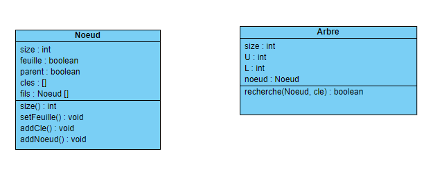

# Projet-s6 groupe 2
# Membres du groupe:
Hicham HARRA et Alexandre PY

## objectif du projet:
Modelisation de la structure Arbre_B et l'implementation
de l'algorithme de recherche,d'insertion et de suppression.

## Livrabe 1:
Modelisation des Classes Noeud et Arbre:
Nous avons modéliser l’arbre avec deux classes :
* classe Nœud :
qui définie les nœud de l’arbre, qui caractérisé par
- la taille : nombre de clés dans l’arbre
-feuille : bool True si le nœud est une feuille 
-parent : le nœud parent
-clés:liste des clés (les valeurs)
-fils :liste des nœuds fils à ce nœud (de taille maximale : taille de la liste des clés +1( notions des pointeurs)).

* Classe Arbre qui représente l’arbre_B, caractérisé par :
-size : taille de l’arbre
-U : nombre de nœuds fils max
-L : nombre de nœuds fils min
-nœud: nœud racine 



## ALgorithmes
pour ce livrable nous avons reussi à finir l'algorithme de recherche
#### ALgorithme de recherche:
```
Entrées : noeud (racine de l'arbre) e element à chercher
Sortie : un boolean True s'il exite dans l'arbre, False sinon.
si le noeud est une feuille:
	resultat <- e in liste des cles du noeud
sinon si e est dans la liste des cles :
	resultats  <- True
sinon:
	i=0
	ind=-1;
	tant que n < nombre des cles et ind ==-1:
		 si e liste des cles[i]:
		     ind =i
		 i++
	si ind ==-1:
	      ind = nombre de cles
	resultat <- recherche(e,fils[ind])
renvoyer resultat
```
* dans l'appel recursif à chaque fois on cherche l'indice de sous arbre où on cherche, donc la recursivité s'applique seulement sur un sous noeud à chaque fois.
cela nous donne une complexité égale à la hauteur de l'arbre dans le pire des cas donc  Θ(logn(n)). 
* la recheche dans la liste des cles on utilise la recherche dichitomique afin de garantir la bonne complexité.
* nous avons defini une classe tests qui verifie le bon fonctionnement de l'algorithme de rechherche.
